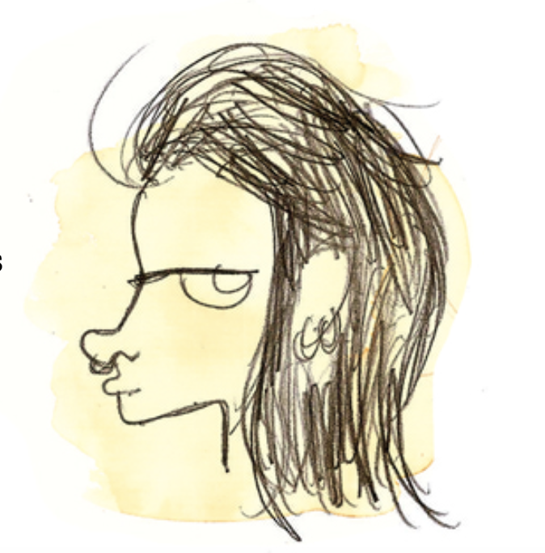

La Compagnie Fais-Le Moi-Même est née de la rencontre de deux artistes trans-disciplinaires, deux doux punks du spectacle vivant et leur approche artistique basé sur le Do It Yourself.
D’une envie brûlante d’en découdre avec le plateau,

Mais pas seulement le plateau de théâtre.

L’envie de se saisir de tous les espaces de jeux possibles. 

Le besoin de « faire avec » le public, l’embarquer dans le processus de création. 
Puiser directement dans le vivant, le réel. 


L’urgence de prendre la parole, de parler de ce qui nous anime, de partager la force de nos inspirations,

De nous amuser de nos accidents de parcours, 

Et le faire avec engagement et tendresse.

De l’engagement pour aborder des problématiques confrontantes 

Et de la tendresse pour construire des images sereines, afin de recharger les batteries émotionnelles qui nous permettront d’affronter la complexité du monde.

Et jouer quoi qu’il arrive. 

Revenir à l’essence du théâtre,

Avec les moyens du bord.
  
Bricoler du vivant, en somme.

>*Faites des bêtises mais faites les avec enthousiasme*

C'est un peu autour de cet adage que nous bidouillons des trucs ensemble depuis 2016.

Nous, c'est : 

### Chloé Thorey

Je suis comédienne, musicienne, et je fais de la vidéo.
