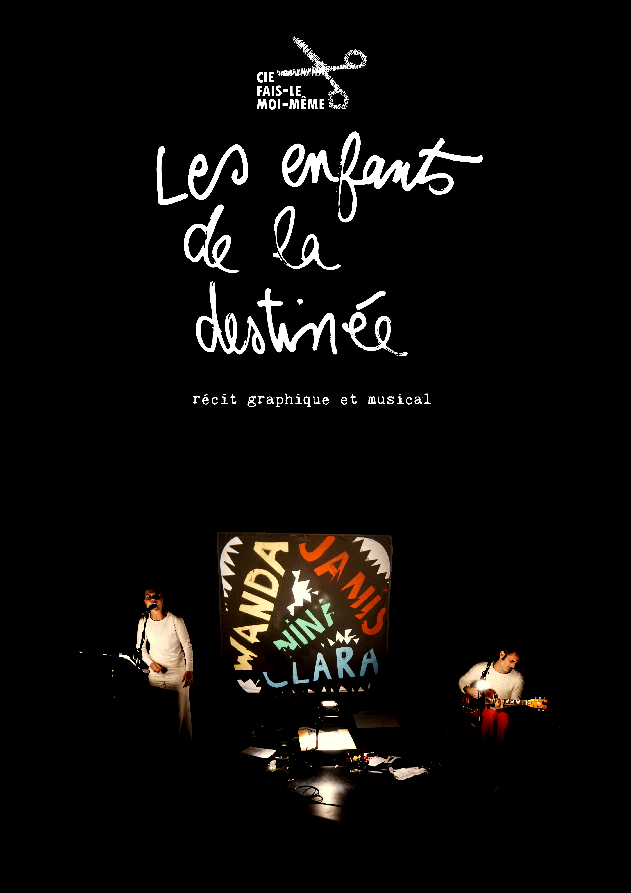

# **Les Enfants de la Destinée**

C’est un spectacle qui s’adresse à ceux qui ne sont plus des enfants, pour leur proposer de regarder derrière eux. 
Demandons nous si on a tenu les promesses de nos ambitions naïves.

Et pour questionner nos destinées, on convoque des histoires vraies. 
Celles de quatre femmes, toutes musiciennes, qui avaient des rêves qu’elles n’ont pas atteint, des destins contrariées, des accidents de parcours. 
Mais toutes ont su, à leurs manières, faire un saut de biche au dessus des croche-pieds.  
C’est une galerie de portraits dans laquelle on retrouve les parcours chaotiques et inspirants de Janis Joplin et Nina Simone, mais également les histoires de géniEs de l’ombre comme Clara Schuman ( la femme de Robert ) ou Wanda Jackson (légende du rock’n roll… et choriste d’Elvis Presley).

On va vous parler de ce petit panthéon qu’on punaise sur les murs de nos chambres de grands enfants pour nous donner envie de croire en quelque chose. 

Et tout ça se fait avec un rétro-projecteur d’antan, une guitare électrique, une paire de ciseaux ,un écran blanc et 2 ampoules. 

<iframe width="560" height="315" src="https://www.youtube.com/embed/O2ERxNmiDUI" title="YouTube video player" frameborder="0" allow="accelerometer; autoplay; clipboard-write; encrypted-media; gyroscope; picture-in-picture; web-share" allowfullscreen></iframe>